# Squeeze‑Alice — интеграция мультирум‑колонок Lyrion Music Server в Умный Дом Яндекс

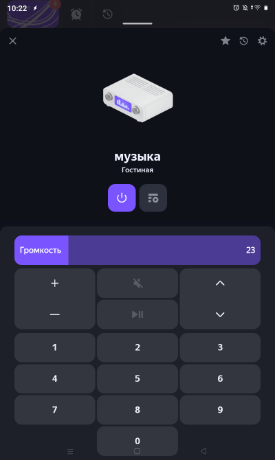

- Голосовое управление LMS плеерами через Алису
- Включение каналов, соответствующих закладкам в Избранном LMS
- Использование LMS плееров в сценариях УДЯ
- Автоматическая синхронизация колонок при включении
- Выключение всех колонок одной кнопкой или одной командой
- Установка громкости при включении с задержкой для ожидания выхода плеера из спящего режима
- Установка громкости при включении колонки в зависимости от времени суток
- Ограничение максимальной громкости от случайного превышения
- Управление с телефона через виджеты Tasker и отображение состояния плееров
- Управление кнопками с пульта
- Поиск в Spotify и Избранном с голосового пульта (Yandex SST)
- Передача голосовых и звуковых уведомлений на колонки LMS (Yandex TTS)
- Репитер пульта для увеличения расстояния

## Голосовое управление устройством УДЯ «музыка»

- **«Алиса, включи музыку»** — Включит воспроизведение ⏯️.  
  Если есть колонка или группа уже играющая, то подключит колонку к играющим.  
  При включении колонки громкость будет установлена в соответствии с временем суток.  
  Если плейлист пустой, то включит Избранное 1.

- **«Алиса, выключи музыку»** — Остановит воспроизведение на колонке в комнате; если колонка была в группе, остальные комнаты продолжат играть.

- **«Алиса, канал 5»** — Включит из Избранного LMS закладку 5.

- **«Алиса, переключи канал»** — Включит следующую закладку в Избранном LMS.

- **«Алиса, музыку громче/тише»** — Изменит громкость плеера в LMS.

- **«Алиса, музыка громкость 15»** — Установит громкость 15 плеера в LMS.

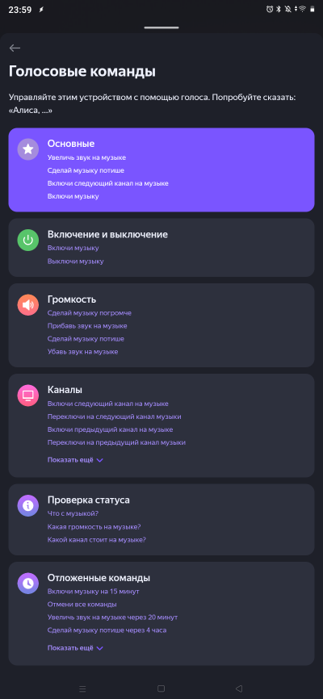

## Управление через голосовой навык Алисы

«раз два» — имя для активации навыка.

- **«Алиса, скажи раз два, включи Kraftwerk»** — Найдёт в Spotify исполнителя Kraftwerk.
- **«Алиса, скажи раз два, включи избранное джаз»** — Найдёт в Избранном LMS закладку, в названии которой есть «джаз».
- **«Алиса, скажи раз два, что играет»** — Алиса ответит название трека и громкость.
- **«Алиса, скажи раз два, какая громкость»** — Алиса ответит текущую громкость и ограничение громкости.
- **«Алиса, скажи раз два, переключи сюда»** — Перенесёт воспроизведение на колонку LMS в этой комнате.
- **«Алиса, скажи раз два, только тут»** — Включит колонку в комнате (если не играла) и выключит все остальные.
- **«Алиса, скажи раз два, добавь в избранное»** — Добавит текущий трек в избранное LMS.
- **«Алиса, скажи раз два, отдельно»** — Заблокирует автосинхронизацию плеера LMS.
- **«Алиса, скажи раз два, вместе»** — Отменит блокировку автосинхронизации плеера LMS.


переключи сюда, также переключает на колонку из Spotify с телефона если сейчас играет.

Для настройки:

- **«Алиса, скажи раз два, где пульт»** — Алиса ответит, к какой колонке LMS подключён пульт.
- **«Алиса, скажи раз два, подключи пульт»** — Пульт подключится к колонке LMS в комнате.
- **«Алиса, скажи раз два, это комната Гостиная»** — Привяжет колонку Яндекс с Алисой к этой комнате.
- **«Алиса, скажи раз два, выбери колонку homepod»** — Привяжет колонку LMS к этой комнате.
- **«Алиса, скажи раз два, лимит 60»** — Установит ограничение громкости 60 для плеера LMS.

Этот навык пока ещё приватный, но я могу прислать вам ссылку.

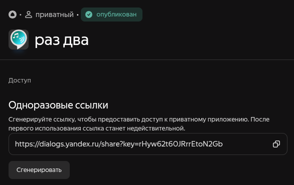

## Управление с телефона виджетами Tasker

### Доступ к управлению всеми плеерами прямо с рабочего стола не заходя в приложение

`tasker/squeeze-tasker.prj.xml`  
[https://taskernet.com Project - Lyrion Music Server Widgets](https://taskernet.com/?user=AS35m8l41V5ZEnau2L8l%2Feyup%2F3dACIp9knWIQaItDG9k2AY77ZyUTy5Vq2Zvd0TdHMDzA%3D%3D)

- виджеты для всех команд управления
- голосовой поиск в Spotify
    - включи <исполнитель>
    - включи альбом <исполнитель> <альбом>
    - включи трек <исполнитель> <трек>
- виджеты колонок для выбора и отображения сосотояния
- текстовый виджет состояния всех плееров
- текстовый виджет плейлиста
- отправка голосового сообщения на колонку LMS

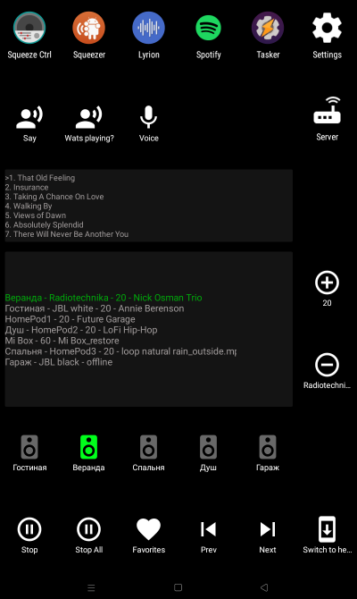
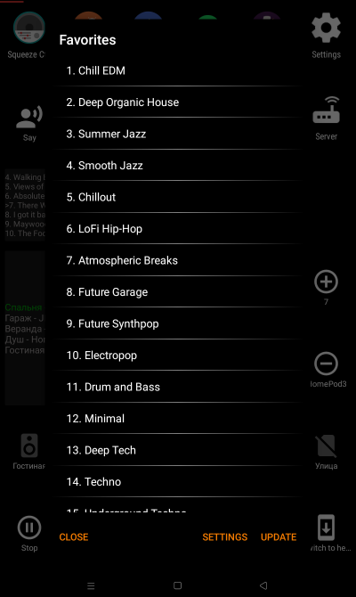
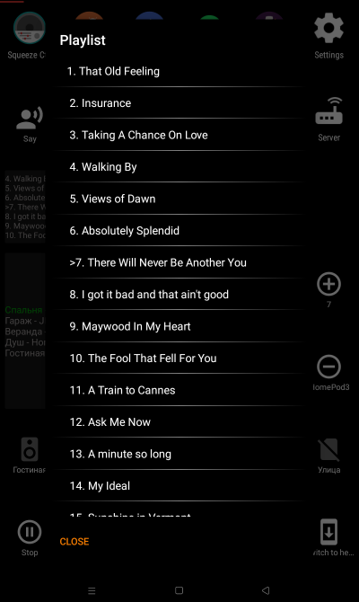

## Управление с голосового пульта

- Нажать кнопку микрофон 🎤 на пульте.
- После сигнала в колонке LMS произнести в пульт запрос, например «включи Kraftwerk».
    - включи <исполнитель>
    - включи альбом <исполнитель> <альбом>
    - включи трек <исполнитель> <трек>
- Звуковой сигнал после записи голоса.
- Записанный голос распознаётся через Yandex SST.
- По полученному тексту находится исполнитель в Spotify.
- Колонка LMS ответит «Включаю Kraftwerk».
- Включится воспроизведение Kraftwerk на колонке LMS.

### Кнопки для пульта G20pro

- 🎤 — голосовой поиск в Spotify
- 1️⃣ … 9️⃣ — закладки в Избранном LMS
- ➕ — громче
- ➖ — тише
- ⏯️ play/pause — для колонки LMS в этой комнате (остальные продолжат играть)
- ◀️ previous track
- ▶️ next track
- 🔼 previous channel
- 🔽 next channel
- ⏮️ rewind 20s
- ⏭️ forward 20s
- ⏹ stop all — выключить все LMS‑колонки в доме
- **Del** — «что играет» (колонка LMS ответит название и громкость)
- 🏠 «переключи сюда» — музыка переключится на эту колонку, другие выключатся
- **Pg+** — переключить пульт на следующую колонку LMS

переключи сюда, также переключает на колонку из Spotify с телефона если сейчас играет.

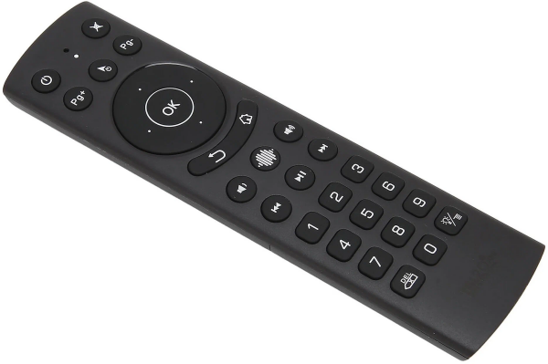

Настраиваются кнопки в файле `config.conf` (пример для play/pause):

```json
{"code": 164, "description": "KEY_PLAYPAUSE", "command": "/cmd?player=btremote&action=play_pause"}
```

## Удлиннитель bt пульта
Если использовать пульт в комнате далеко от сервера с LMS можно использовать orangePiZero как репитер для пульта, установив на него
`squeeze_remote/btremote.py`
`squeeze_remote/voice.py`

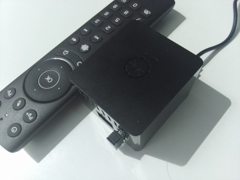


## Управление с пульта телевизора
`tasker/squeeze-tasker.prj.xml`  
устанавливается на android tv или tv box
для назначения действий на кнопки можно использовать tvQuickActions  
Тут уже смотря какой пульт и сколько на нем бесполезных кнопок, например так:
- mute - play/pause
- mute (doble) - stop all
- mute (long) - Избранное LMS
- menu (long) - виртуальный dpad tvquickactions для громкости и переключения треков

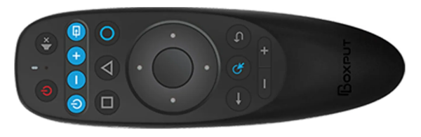
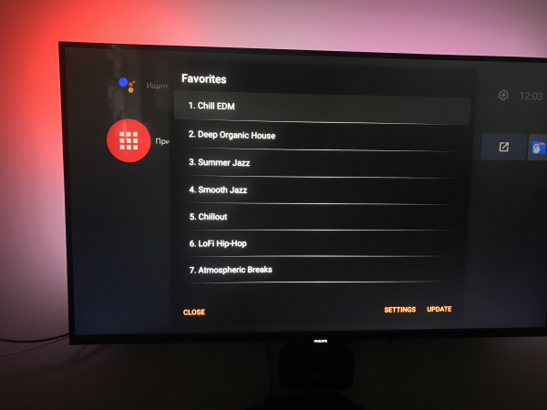
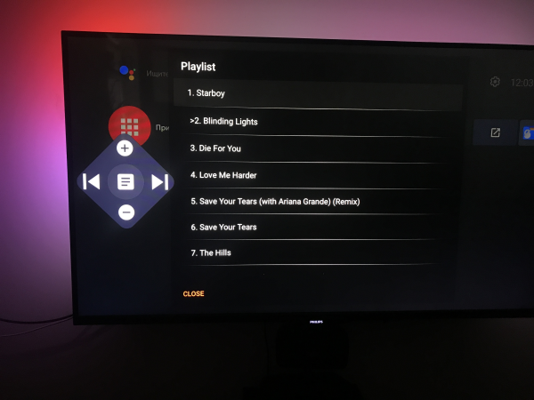


---


### 🖥️ Веб‑интерфейс

Доступен по адресу `http://<ip-сервера>:8010`

- Авторизация в Яндексе и Spotify.
- Настройка плееров:
  - Привязка к комнате УДЯ
  - ожидание пробуждения плеера
  - ограничение громкости
  - пресеты громкости по времени


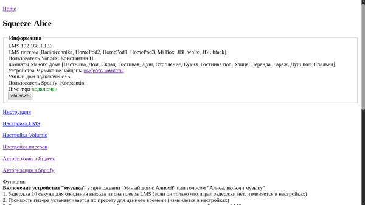


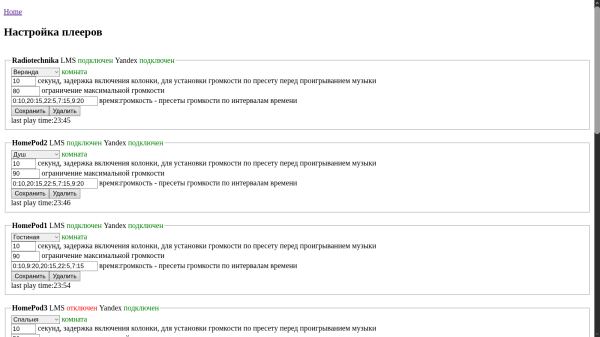

---
## ⚙️ Установка и настройка

Скачайте последний релиз или клонируйте репозиторий:

```bash
git clone https://github.com/knovash/squeeze-alice.git
cd squeeze-alice
mvn clean package
java -jar target/squeeze-alice-1.0.jar
```

Можно использовать скрипт установки, подставив IP‑адрес на который установить.

```bash
./install_mvn_ssh_192.168.1.131.sh   
```

Для windows есть какието bat файлы, но это неточно...

После установки сервис будет доступен по адресу http://<IP-адрес>:8010/.

1. Если сервис успешно обнаружил LMS то будет список плееров из LMS
2. Авторизуйтесь в Яндекс для соединения с акаунтом умного дома
3. Если авторизация успешна то будет список комнат из УДЯ
4. Перейдите в настройку плееров и выберете соответствующие комнаты
5. В приложении Яндекс «Умный дом» 
 - Добавить > Устройство умного дома
 - Найти производителя Lyrion Music Server
 - Нажать "Привязать к Яндексу"
 - Нажать "Обновить список устройств"
 - Нажать "Ура, теперь всё готово!"

Этого достаточно для управления плеерами LMS через УДЯ.
1. Сервис запущен, найдены плееры в LMS

   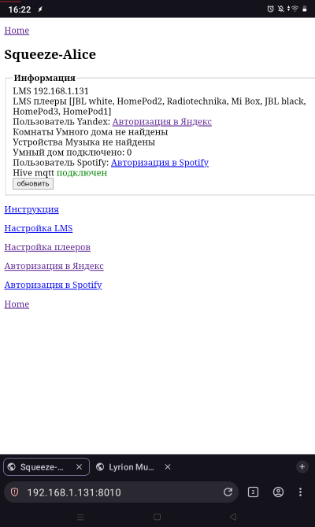

2. Авторизация в Яндекс

   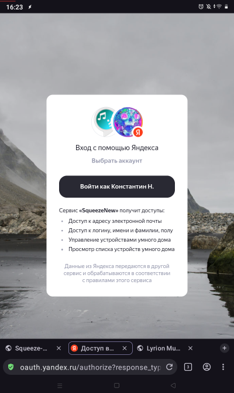

3. После авторизации получены комнаты из УДЯ

   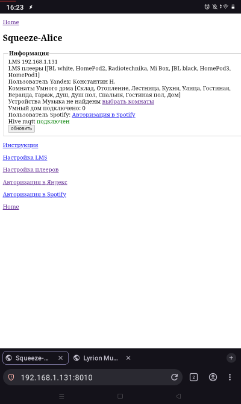

4. Плееры, комнаты не выбраны

   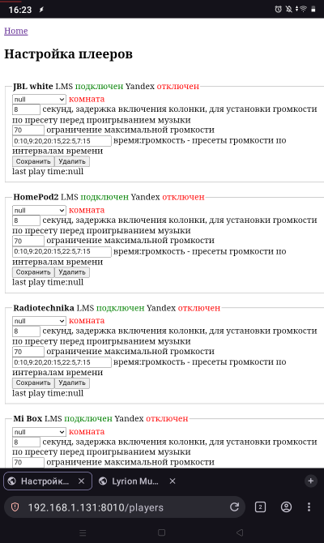

5. Плееры, комнаты выбраны

   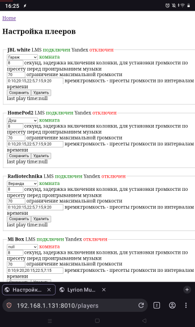

6. УДЯ добавить устройство

   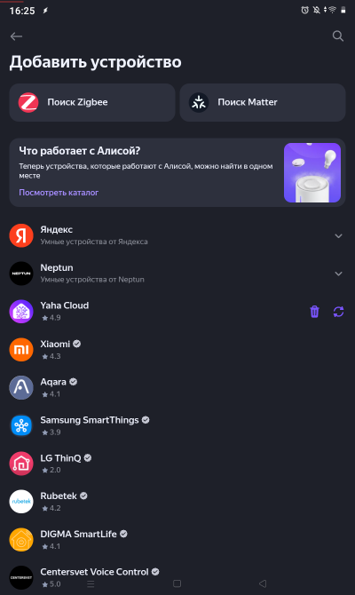

7. Найти Lyrion Music Server

   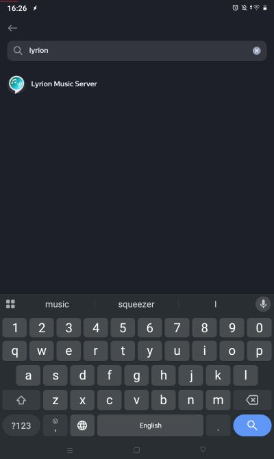

8. Привязать к Яндексу

   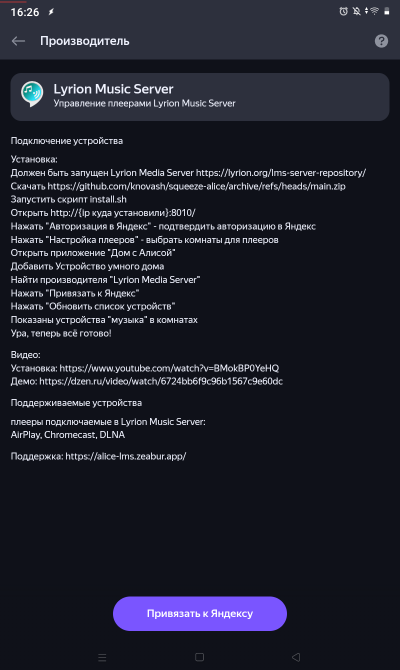

9. Вход в Яндекс

    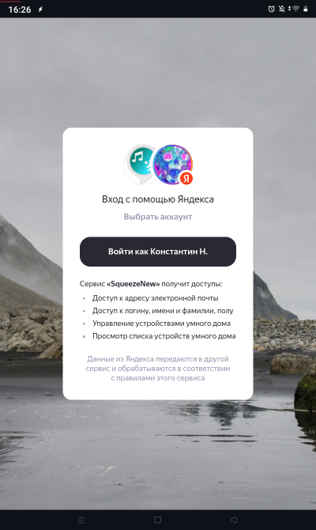

10. Подтверждение доступа

    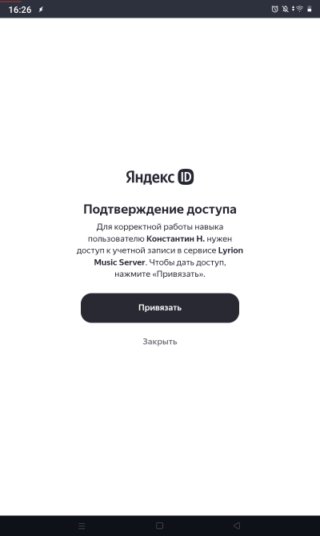

11. Устройства успешно добавлены!

    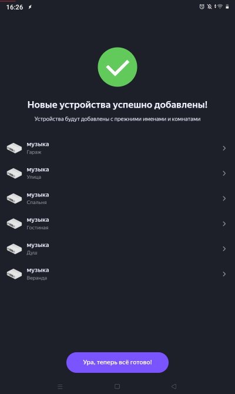

12. Новые устройства в доме

    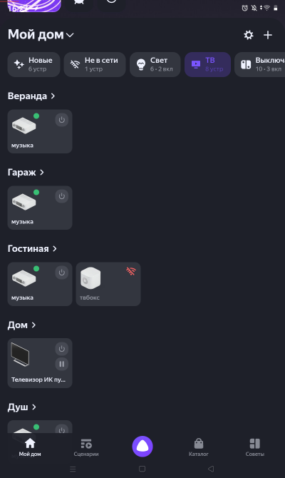

---

Ещё можно добавить:  
- Установить на телефон tasker/squeeze-tasker.prj.xml для виджетов управления и отображения плееров
- Голосовой навык Раз Два для голосового поиска и дополнительных команд
- Авторизоваться в Spotify для поиска
- Установить squeeze_remote/btremote.py для управления пультом
- Установить squeeze_remote/voice.py для голосового поиска с пульта

Баги есть, но я над этим иногда работаю...

TODO:
- отправка голосового сообщения на колонку с телефона не дома, через mqtt.
- добавить еще голосовых уведомлений через колонку в LMS
- настройки вкл/выкл голосовых уведомлений
- голосовой поиск в избранном сейчас только на русском, плохо работает с транскрипцией в англиский
- управление громкостью уведомлений, сейчас через ffmpeg, сделать изменение громкости в LMS или в tts

## Зачем я это делал?
- Чтобы не объяснять никому дома как включить музыку на колонки из Lyrion или Spotify и прочего. Просто нажми кнопку на пульте или скажи алисе включи музыку, избранное, альбом...
- Чтобы не объяснять как управлять синхронизацией колонок, просто включи музыку, выключи музыку, переключи сюда.
- Когда вы перед телевизором, не нужно искать телефон или думать про голосовые команды. Достаточно нажать кнопку на том же пульте ТВ чтоб выключить музыку в комнате или во всем доме.
- Просто включить телефон или планшет и сразу увидеть состояние всех плееров не заходя ни в какие приложения, выполнять с экрана действия с колонками в пару кликов.
- Пульт с реальными кнопками — самый интуитивный интерфейс. На него не нужно смотреть, и кнопки запоминаются на уровне мышечной памяти, это как кнопки в автомобиле, быстро и понятно. Управлять музыкой, не отвлекаясь на экраны, — только пульт и колонки.
- Каждая фича просто становилась необходимой мне в какойто момент и я ее добавлял.
- Почему LMS, а не мультирум на Яндекс Станциях? Нет ограничений. В LMS можно подключить любые колонки и множество источников музыки.

