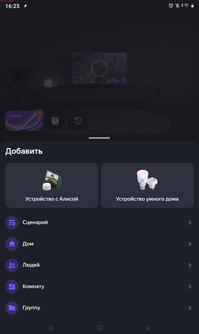

# Squeeze‑Alice
## Это интеграция мультирум колонок Lyrion Music Server в Умный Дом Яндекс

- Голосовое управление LMS плеерами через Алису
- Включение каналов соответствующих закладкам в Избранном LMS
- Использование LMS плееров в сценариях УДЯ
- Автоматическая синхронизация колонок при включении
- Выключение всех колонок одной кнопкой или одной командой
- Установка громкости при включении с задержкой, для ожидания выхода плеера из спящего режима
- Установка громкости при включении колонки в зависимости от времени суток
- Ограничение максимальной громкости от случайного превышения
- Управление с телефона через виджеты Tasker и отображение состояния плееров
- Управление кнопками с пульта
- Поиск в Spotify и Избранном с голосового пульта (Yandex SST)
- Передача голосовых и звуковых уведомлений на колонки LMS (Yandex TTS)
- Репитер пульта для увеличения расстояния
## Голосовое управление устройством УДЯ «музыка»
- **«Алиса, включи музыку»** - Включит воспроизведение⏯️. Если есть колонка или группа уже играющая, то подключит колонку к играющим
 при включении колонки громкость будет установлена в соответствии с временем суток.
Если плейлист пустой, то включит Избранное 1.
- **«Алиса, выключи музыку»** - Воспроизведение остановит на колонке в комнате, если была в группе то остальные комнаты продолжат играть.
- **«Алиса, канал 5»** - Включит из Избранного LMS закладку 5.
- **«Алиса, переключи канал»** - Включит следущую закладку в Избранном LMS.
- **«Алиса, музыку громче/тише»** - Изменение громкости плеера в LMS.
- **«Алиса, музыка громкость 15»** - Установка громкости 15 плеера в LMS.


## Управление через голосовой навык Алисы
«раз два» - имя для активация навыка
- **«Алиса, скажи раз два, включи Kraftwerk»** - Найдет в Spotify исполнителя Kraftwerk.
- **«Алиса, скажи раз два, включи избранное джаз»** - Найдет в Избранном LMS закладку в названии которой "джаз".
- **«Алиса, скажи раз два, что играет»** - Алиса ответит название и громкость.

- **«Алиса, скажи раз два, какая громкость»** - Алиса ответит громкость и ограничение громкости.
- **«Алиса, скажи раз два, переключи сюда»** - Перенос воспроизведения на колонку LMS в этой комнате.
- **«Алиса, скажи раз два, только тут»** - Включится колонка в комнате, если не играла, все остальные выключатся.
- **«Алиса, скажи раз два, добавь в избранное»** - Добавление в избранное LMS
- **«Алиса, скажи раз два, отдельно»** - Блокировка автосинхронизации плеера LMS.
- **«Алиса, скажи раз два, вместе»** - Отмена блокировки автосинхронизации плеера LMS.
для настройки
- **«Алиса, скажи раз два, где пульт»** - Алиса ответит к какой колонке LMS подключен пульт.
- **«Алиса, скажи раз два, подключи пульт»** - Пульт подключится к колонке LMS в комнате.
- **«Алиса, скажи раз два, это комната Гостиная»** - Привязка колонки Яндекс с Алисой к этой комнате.
- **«Алиса, скажи раз два, выбери колонку homepod»** - Привязка колонки LMS к этой комнате.
- **«Алиса, скажи раз два, лимит 60»** - Ограничение громкости 60 плеера LMS.

этот навык пока еще приватный, но я могу прислать вам ссылку.


## Управление с телефона виджетами Tasker

tasker/squeeze-tasker.prj.xml


## Управление с голосового пульта
- нажать кнопку микрофон 🎤 на пульте
- после сигнала в колонке LMS произнести в пульт запрос "включи Kraftwerk"
- звуковой сигнал после записи голоса
- записанный голос распознается через Yandex SST
- по полученному тексту находится исполнитель в Spotify 
- колонка LMS ответит "Включаю Kraftwerk"
- включится воспроизведение Kraftwerk на колонке в LMS

кнопки для пульта G20pro
- 🎤 - голосовой поиск в Spotify
- 1️⃣ ... 9️⃣ - закладки в Избранном LMS
- ➕ - громче
- ➖ - тише
- ⏯️ play/pause - для колонки LMS в этой комнате, остальные продолжат играть
- ◀️ previous track
- ▶️ next track
- 🔼 previous channel
- 🔽 next channel
- ⏮️ rewind 20s
- ⏭️ forward 20s
- ⏹ stop all - выключить все LMS колонки в доме
- Del - что играет - колонка LMS ответит название и громкость
- 🏠 переключи сюда - музыка переключится на эту колонку, другие выключаться
- Pg+ - переключить пульт на следующую колонку LMS


настраиваются кнопки в файле config.conf

```
{"code": 164, "description": "KEY_PLAYPAUSE",   "command": "/cmd?player=btremote&action=play_pause"},
```

---


### 🖥️ Веб‑интерфейс

Доступен по адресу `http://<ip-сервера>:8010`

- Авторизация в Яндексе и Spotify.
- Настройка плееров:
  - Привязка к комнате УДЯ
  - ожидание пробуждения плеера
  - ограничение громкости
  - пресеты громкости по времени


---
## ⚙️ Установка и настройка

Скачайте последний релиз или клонируйте репозиторий:

```bash
git clone https://github.com/knovash/squeeze-alice.git
cd squeeze-alice
mvn clean package
java -jar target/squeeze-alice-1.0.jar
```

Можно использовать скрипт установки, подставив IP‑адрес на который установить.

```bash
./install_mvn_ssh_192.168.1.131.sh   
```

Для windows есть какието bat файлы, но это неточно...

После установки сервис будет доступен по адресу http://<IP-адрес>:8010/.

1. Если сервис успешно обнаружил LMS то будет список плееров из LMS
2. Авторизуйтесь в Яндекс для соединения с акаунтом умного дома
3. Если авторизация успешна то будет список комнат из УДЯ
4. Перейдите в настройку плееров и выберете соответствующие комнаты
5. В приложении Яндекс «Умный дом» 
 - Добавить > Устройство умного дома
 - Найти производителя Lyrion Music Server
 - Нажать "Привязать к Яндексу"
 - Нажать "Обновить список устройств"
 - Нажать "Ура, теперь всё готово!"

Этого достаточно для управления плеерами LMS через УДЯ.


1. Сервис запущен, найдены плееры в LMS


2. Авторизация в Яндекс


3. После авторизации получены комнаты из УДЯ


4. Плееры, конмнаты не выбраны


5. Плееры, комнаты выбраны


6. УДЯ добавить устройство


7. УДЯ добавить устройство


8. Найти Lyrion Music Server


9. Привязать к Яндексу


10. Вход в Яндекс


11. Подтверждение доступа


12. Устройства успешно добавлены!


13. Новые устройства в доме


Еще можно добавить:
- Установить на телефон tasker/squeeze-tasker.prj.xml для виджетов управления и отображения плееров
- Голосовой навык Раз Два для голосового поиска и дополнительных команд
- Авторизоваться в Spotify для поиска
- Установить squeeze_remote/btremote.py для управления пультом
- Установить squeeze_remote/voice.py для голосового поиска с пульта

баги есть. но я над этим иногда работаю...